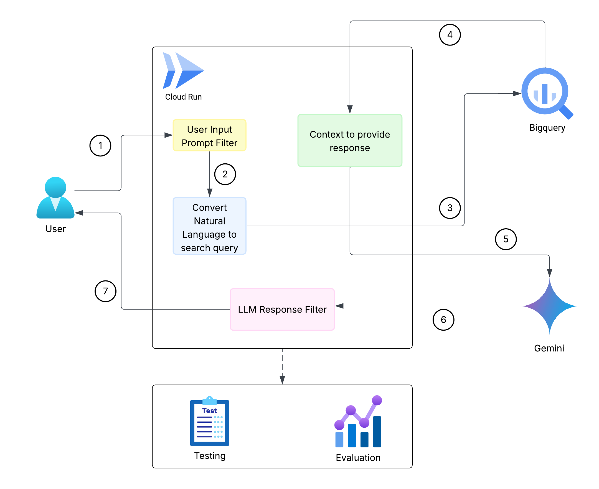

# Alaska Department of Snow Chatbot

## Introduction

The Alaska Department of Snow Chatbot is a Retrieval-Augmented Generation (RAG) based AI assistant designed to provide information about snow management, road conditions, and related services in Alaska. The chatbot uses Google's Gemini LLM combined with a BigQuery vector database to deliver accurate, contextually relevant responses to user queries.

Key features of the chatbot include:
- **RAG Architecture**: Combines the power of LLMs with retrieval from a knowledge base
- **Safety Filters**: Input and output safety checks to ensure appropriate interactions
- **Vector Search**: Semantic search capabilities to find relevant information
- **Streamlit UI**: User-friendly web interface for interacting with the chatbot
- **Containerization**: Docker support for easy deployment to Google Cloud Run

The chatbot is designed to assist Alaskans with snow-related inquiries and help them access the services they need from the Alaska Department of Snow.

## Live Demo

The Alaska Department of Snow Chatbot is deployed and accessible at:

**[https://ads-chatbot-594676763679.us-central1.run.app](https://ads-chatbot-594676763679.us-central1.run.app)**

This live demo is hosted on Google Cloud Run and provides a fully functional interface to interact with the chatbot.

### Demo Video

Watch the demo video to see the chatbot in action:

[Alaska Department of Snow Chatbot Demo Video](Alaska%20Department%20of%20snow%20Chatbot%20demo.mp4)

This is the very short demo video that demonstrates key features of the chatbot, including:
- User interaction with the chatbot interface
- Processing of various snow-related queries
- Retrieval of relevant information from the knowledge base
- Safety filtering in action

## Folder Structure

```
alaska-snow-chatbot/
├── .env                      # Environment variables
├── .streamlit/               # Streamlit configuration
│   └── config.toml           # Streamlit UI configuration
├── Dockerfile                # Container definition for deployment
├── README.md                 # Project documentation
├── cloud-run-deployment.md   # Deployment guide for Google Cloud Run
├── conceptual-diagram.png    # Conceptual diagram of the system
├── requirements.txt          # Python dependencies
├── src/                      # Source code
│   ├── __init__.py           # Makes src a Python package
│   ├── chatbot_service.py    # Core chatbot logic and safety filters
│   ├── chatbot_ui.py         # Streamlit user interface
│   ├── dao.py                # Data access for BigQuery vector search
│   ├── gemini_client.py      # Google Gemini LLM client
│   ├── prompts.py            # System and safety filter prompts
│   └── utils.py              # Utility functions
└── test/                     # Test code
    ├── __init__.py           # Makes test a Python package
    └── chatbot_service_test.py # Tests for chatbot functionality
```

## Conceptual Diagram



The diagram illustrates the flow of information through the system, from user input to response generation.

## Call Flow

1. **User Input**
   - A user initiates interaction via a chatbot interface deployed on a frontend (e.g., website or app).
   - The user's query (natural language) is sent to the backend application hosted on Cloud Run.

2. **User Input Prompt Filter**
   - The query first passes through a Prompt Filter to:
   - Sanitize inputs (e.g., remove profanity or malicious patterns).
   - Enforce security and policy constraints.
   - Check for compliance with prompt rules (e.g., not asking private or irrelevant questions).

3. **Convert Natural Language to Search Query**
   - The validated prompt is converted into a structured search/query format, using:
   - Rules or LLM-based transformation
   - SQL template filling
   - Metadata tagging

4. **Query BigQuery**
   - The transformed query is used to fetch relevant structured data from BigQuery.
   - This can include snow plowing schedules, road closures, historical weather events, etc.

5. **Context Construction**
   - The retrieved data is formatted and used as context for a response.
   - This context is fed into Gemini to generate a natural, human-like response.

6. **Gemini Response + LLM Response Filter**
   - Gemini generates a response based on the prompt and context.
   - Before sending it to the user, the response goes through the LLM Response Filter:
   - Ensures factual accuracy
   - Removes hallucinated or unsafe outputs
   - Validates formatting, tone, or specific domain rules

7. **Final Response to User**
   - The filtered response is returned to the user via the frontend interface.

## Components Used

### Google Cloud Services

- **Gemini LLM**: Google's large language model for generating responses
- **BigQuery**: Vector database for storing and retrieving knowledge base information
- **Cloud Run**: Serverless platform for deploying the containerized application

### Python Libraries

- **streamlit (v1.44.1)**: Web application framework for the user interface
- **google-genai (v1.20.0)**: Client library for the Gemini API
- **google-cloud-bigquery (v3.34.0)**: Client library for BigQuery
- **vertexai (v1.71.1)**: Google Cloud Vertex AI library

### Development Tools

- **Docker**: Containerization for deployment
- **pytest**: Testing framework for unit tests

### Architecture Patterns

- **RAG (Retrieval-Augmented Generation)**: Combines retrieval from a knowledge base with LLM generation
- **Singleton Pattern**: Used for the Gemini client to ensure efficient resource usage
- **Safety Filtering**: Input and output safety checks to ensure appropriate interactions
